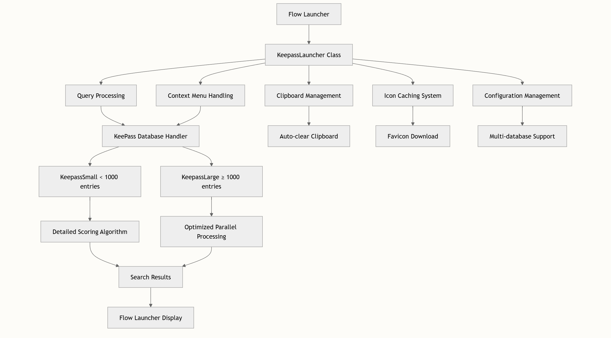
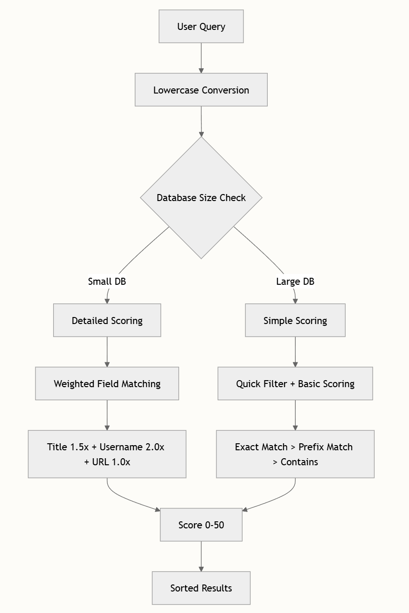

[![zread](https://img.shields.io/badge/Ask_Zread-_.svg?style=plastic&color=00b0aa&labelColor=000000&logo=data%3Aimage%2Fsvg%2Bxml%3Bbase64%2CPHN2ZyB3aWR0aD0iMTYiIGhlaWdodD0iMTYiIHZpZXdCb3g9IjAgMCAxNiAxNiIgZmlsbD0ibm9uZSIgeG1sbnM9Imh0dHA6Ly93d3cudzMub3JnLzIwMDAvc3ZnIj4KPHBhdGggZD0iTTQuOTYxNTYgMS42MDAxSDIuMjQxNTZDMS44ODgxIDEuNjAwMSAxLjYwMTU2IDEuODg2NjQgMS42MDE1NiAyLjI0MDFWNC45NjAxQzEuNjAxNTYgNS4zMTM1NiAxLjg4ODEgNS42MDAxIDIuMjQxNTYgNS42MDAxSDQuOTYxNTZDNS4zMTUwMiA1LjYwMDEgNS42MDE1NiA1LjMxMzU2IDUuNjAxNTYgNC45NjAxVjIuMjQwMUM1LjYwMTU2IDEuODg2NjQgNS4zMTUwMiAxLjYwMDEgNC45NjE1NiAxLjYwMDFaIiBmaWxsPSIjZmZmIi8%2BCjxwYXRoIGQ9Ik00Ljk2MTU2IDEwLjM5OTlIMi4yNDE1NkMxLjg4ODEgMTAuMzk5OSAxLjYwMTU2IDEwLjY4NjQgMS42MDE1NiAxMS4wMzk5VjEzLjc1OTlDMS42MDE1NiAxNC4xMTM0IDEuODg4MSAxNC4zOTk5IDIuMjQxNTYgMTQuMzk5OUg0Ljk2MTU2QzUuMzE1MDIgMTQuMzk5OSA1LjYwMTU2IDE0LjExMzQgNS42MDE1NiAxMy43NTk5VjExLjAzOTlDNS42MDE1NiAxMC42ODY0IDUuMzE1MDIgMTAuMzk5OSA0Ljk2MTU2IDEwLjM5OTlaIiBmaWxsPSIjZmZmIi8%2BCjxwYXRoIGQ9Ik0xMy43NTg0IDEuNjAwMUgxMS4wMzg0QzEwLjY4NSAxLjYwMDEgMTAuMzk4NCAxLjg4NjY0IDEwLjM5ODQgMi4yNDAxVjQuOTYwMUMxMC4zOTg0IDUuMzEzNTYgMTAuNjg1IDUuNjAwMSAxMS4wMzg0IDUuNjAwMUgxMy43NTg0QzE0LjExMTkgNS42MDAxIDE0LjM5ODQgNS4zMTM1NiAxNC4zOTg0IDQuOTYwMVYyLjI0MDFDMTQuMzk4NCAxLjg4NjY0IDE0LjExMTkgMS42MDAxIDEzLjc1ODQgMS42MDAxWiIgZmlsbD0iI2ZmZiIvPgo8cGF0aCBkPSJNNCAxMkwxMiA0TDQgMTJaIiBmaWxsPSIjZmZmIi8%2BCjxwYXRoIGQ9Ik00IDEyTDEyIDQiIHN0cm9rZT0iI2ZmZiIgc3Ryb2tlLXdpZHRoPSIxLjUiIHN0cm9rZS1saW5lY2FwPSJyb3VuZCIvPgo8L3N2Zz4K&logoColor=ffffff)](https://zread.ai/iQuick/Flow.Launcher.KeepassX)

# KeepassX

## 概述 
Flow.Launcher.KeepassX 是一款专为 Flow Launcher 设计的精密密码管理插件，提供与 KeePass 数据库的无缝集成。该插件使用户能够直接通过 Flow Launcher 界面快速搜索和检索 KeePass 数据库中的密码，将强大的搜索功能与可靠的安全特性相结合。

## 架构概述
该插件采用模块化架构设计，注重性能、可扩展性和可维护性。其核心系统利用两种不同的 KeePass 处理策略，针对不同数据库规模进行优化，确保在各种使用场景下都能实现最佳性能。


## 核心组件
### 主入口点
main.py 文件作为主入口点，包含继承自 FlowLauncher 基类的 KeepassLauncher 类。该类处理所有用户交互、查询处理和 Flow Launcher 集成的结果格式化。

### 主要职责：

* 查询处理和验证 main.py#L25-L42
* 为密码条目生成上下文菜单 main.py#L44-L49
* 处理剪贴板操作的动作 main.py#L85-L87
* 
### KeePass 数据库处理
该插件提供两个针对不同数据库规模优化的专用 KeePass 处理器：

| 处理器       | 数据库规模      | 算法类型   | 性能         | 特性                     |
|--------------|----------------|------------|--------------|--------------------------|
| KeepassSmall | < 1000 条目    | 详细评分   | 小型数据库快速 | 全面匹配，加权评分       |
| KeepassLarge | ≥ 1000 条目    | 优化并行   | 大型数据库可扩展 | 快速过滤，简化评分       |

## 主要功能
### 1. 智能搜索系统
   搜索引擎采用精密的评分算法，根据相关性对结果进行排序：
   
   
### 2. 多数据库支持
该插件可同时无缝处理多个 KeePass 数据库：
```json
{
    "multi": true,
    "databases": [
        {
            "path": "personal.kdbx",
            "password": "******"
        },
        {
            "path": "work.kdbx", 
            "password": "******"
        }
    ]
}
```

`特性：`

跨多个数据库并发搜索
统一的结果呈现，与数据库无关的评分
独立的数据库错误处理，不影响其他数据库


### 3. 自动剪贴板管理
   注重安全的剪贴板管理确保密码安全

   | 功能         | 描述                               | 配置                 |
   |--------------|---------------|-----------------------|
   | 自动清除     | 使用后自动清除剪贴板               | "auto_clear": true        |
   | 延迟配置     | 可自定义清除延迟（秒）             | "auto_clear_delay": 5        |
   | 后台进程     | 非阻塞式剪贴板清除                 | 独立进程执行           |

### 4. 图标缓存系统
   通过自动下载和缓存网站图标实现视觉增强